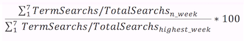

```{r, echo=FALSE, message=FALSE}
options(warn = -1)
suppressPackageStartupMessages(library(dplyr))
suppressPackageStartupMessages(library(ggplot2))
suppressPackageStartupMessages(library(lubridate))
suppressPackageStartupMessages(library(Quandl))
suppressPackageStartupMessages(library(Rmisc))
suppressPackageStartupMessages(library(scales))
suppressPackageStartupMessages(library(plyr))
suppressPackageStartupMessages(library(rvest))
suppressPackageStartupMessages(library(stringr))
suppressPackageStartupMessages(library(plotly))
suppressPackageStartupMessages(library(leaflet))
suppressPackageStartupMessages(library(maps))
suppressPackageStartupMessages(library(rgdal))
suppressPackageStartupMessages(library(maptools))
suppressPackageStartupMessages(library(stringr))
suppressPackageStartupMessages(library(tm))
suppressPackageStartupMessages(library(XML))
suppressPackageStartupMessages(library(gtrendsR))
```
#**A Brief Look into Minimum Wage in the United States: An Analysis Utilizing Data, History, and Economics** 

###**Christian M. Lehner, (BA)^1^ and Albert Y. Kim, PhD^2^**
^1^Expected BA in Economics, Middlebury College, Middlebury, VT   
^2^Assistant Professor of Statistics, Middlebury College, Middlebury, VT.
(Instructed, and Reviewed)
--------------------------------------------------------------------------------------   

##**Abstract**
Objectives --- This research is centered on the history of minimum wage, its relevance today, and future implications in the United States.  
Methods --- Data was collected mainly from the Bureau of Labor Statistics, Quandl, Google Trends, and the Department of Labor. This paper will inform you of the background behind raising the minimum wage, and how soon the federal minimum wage should be raised to 15 dollars an hour, and why it should be indexed.  There is no shortage of research behind purchasing power, the cost of living, and accessibility to consumer goods as the topic is difficult to compare quantitatively. There are many indices that are used to compare the changes in prices, and the cost of living, so it is important to be consistent both in a time series and cross-sectionally. I used the language of R (3.2.3) on the Rstudio platform (0.99.879), and made accessible the code and through GitHub, and RPubs.    
Conclusions --- Minimum wage policy revolves in a stew of both moral motivations and economic effects. This paper attempts to inform you of the important aspects of Minimum Wage with minimal economic complexity, and give basis to your potentially new opinion.

```{r, echo=FALSE, message=FALSE}
ww = readHTMLTable("http://www.governing.com/gov-data/economy-finance/minimum-wage-workers-by-state-statistics-2013-totals.html")

workers_at_min <- as.data.frame(ww[2])
colnames(workers_at_min)[1] <- "NAME"
colnames(workers_at_min)[2] <- "At_or_below"
workers_at_min$At_or_below <- as.character(workers_at_min$At_or_below)  %>%
  removePunctuation() %>%
  stripWhitespace()
workers_at_min$At_or_below <- as.integer(workers_at_min$At_or_below) #code chunk is above to allow for inline code
```


##**Introduction and Background**  
The minimum wage in the United States is set both by the federal government and by states. The federal government sets a national hourly wage floor that all employers have to abide with some exemptions.  States can pass new state minimum hourly wage floors but those floors have to be greater than the federally instituted minimum wage.  Despite the set floors for wages, there are many loop holes to evade paying full wages.  Therefore, as of the 2013 current population survey, there are about `r sum(workers_at_min$At_or_below)` people working at or below the minimum wage.  Thus, as of 2013, an estimated 4.3 percent of hourly earners were being paid the minimum wage or less. In 2014, this percentage decreased to 3.9 percent. Hourly earners make up 58 percent of the 77.2 million people who comprise the US labor force, so there were roughly 3 million people working at or below the minimum wage in 2014 [BLS](http://www.bls.gov/opub/reports/minimum-wage/archive/characteristics-of-minimum-wage-workers-2014.pdf). Of these 3 million workers, roughly 1.7 million were being paid less than 7.25 dollars an hour due to loopholes in the law and working illegally.  Although the data are limited and more extrapolative past the 1950’s, this project investigates minimum wage from its conception in 1938 up to the present.   

As with many major reforms, it took a while for the United States to regulate employers. The Fair Labor Standards Act of 1938 was the first major reform protecting hourly workers and the first to institute a minimum wage and maximum of shift lengths and hours worked in a week. Although the FLSA affected only about one fifth of the labor force and set a 25-cent minimum wage, or about $4 in 2012 dollars, and a 44-hour workweek, it set a precedent for labor regulation.

The FLSA was not passed without contention. The state of New York had instituted a minimum wage before the federal government, and in 1936, Joseph Tipaldo was sent to jail for paying his workers less then the minimum wage.  His lawyers used habeas corpus as the state minimum wage was found to be unconstitutional which rendered the state law void by the Supreme Court decision of Morehead vs. New York. [DOL](https://www.dol.gov/oasam/programs/history/flsa1938.htm)   

The Supreme Court’s decision had the opposite effect however, in the long run. The decision was so unpopular that many rallied behind FDR and his labor reform allowing him to pass the FLSA two years later with a clause about child labor. Even conservatives deemed the Court’s ruling a new “Dred Scott” decision condemning women and children to ‘economic’ slavery, as depicted by Congressmen Hamilton Fish, a conservative himself.  
FDR used his vast support, as shown by his landslide victory for his second term, partially from his repeal of the Prohibition and partly from successful reform, to threaten to pack the court with more justices if they didn’t allow reform. The Conservative Coalition founded at the end of his first term prevented the packing of the Court, but the FLSA was still passed leading to the inaccurate saying “a switch in time saved nine [the justices].” The decision in the case of the West Coast Hotel Company v. Parrish reversed the previous precedent and ruled the minimum wage constitutional. It was Chief Justice Robert’s decision to vote with the liberal minority of the court that allowed for the new precedent and set the country on a new path of labor regulations.  

Still applicable today, FDR was remembered for saying, "Do not let any calamity-howling executive with an income of $1,000 a day, ...tell you...that a wage of $11 a week is going to have a disastrous effect on all American industry." 

[RPubs](http://rpubs.com/clehner/FINAL)

##**Analysis**  

```{r, echo=FALSE, message=FALSE}
wage <- read.csv("data/ECPI-WAGE_AD.csv", header = TRUE) %>% tbl_df
#https://www.quandl.com/data/ECPI/WAGE_AD-Real-value-of-the-minimum-wage-1960-2011
wage$Year <- as.Date(wage$Year)

wage <- wage[order(wage$Year),]

cpi_annual <- read.csv("data/CPI2.csv", header = TRUE) %>% tbl_df
cpi_percent <- read.csv("data/CPI%.csv", header = TRUE) %>% tbl_df
cpi_percent <- rename(cpi_percent, c("Annual"="Change"))
cpi <- left_join(cpi_percent,cpi_annual, by = "Year")
#http://data.bls.gov/pdq/SurveyOutputServlet

webpage <- "https://www.dol.gov/featured/minimum-wage/chart1"
#real in 2012 dollars

nwage <- webpage %>%
  read_html() %>%
  html_nodes("table") %>%
  .[[1]] %>%
  html_table()

nwage <- rename(nwage, c("Nominal Min Wage"="nomwage", "Minimum Wage in 2012 Dollars"="realwage"))
nwage <- filter(nwage, nwage$Year >= 1938)
nmage <- na.omit(nwage)
#renaming, filtering and omitting NA
wage_cpi <- left_join(nwage, cpi, by = "Year") %>%
  select(Year, Change, Annual, nomwage, realwage) %>%
  mutate(nomwage=
    gsub('\\$', '', c(nomwage)),
  realwage=
    gsub('\\$', '', c(realwage)))
#removing dollar sign

wage_cpi$nomwage <- as.numeric(wage_cpi$nomwage)
wage_cpi$realwage <- as.numeric(wage_cpi$realwage)
#changing to numerical

wage_cpi <- wage_cpi %>%
  mutate(keeping_up = NA)
wage_cpi <- wage_cpi %>%
  mutate(diffwage = (realwage-lag(realwage))/(lag(realwage)))

plot2 <- ggplot(data=wage_cpi) +
  geom_bar(aes(Year, diffwage), stat = "identity") +
  labs(title="Percent Increase in Real Mininum Wage") +
  labs(y="%increase")
plot2
```

This chart shows the change of the inflation adjusted minimum wage in percent. After 1940, there has only been only one period of deflation, occurring in 2009 after the Great Recession.  This is the only instance of the minimum wage increasing in real terms because of deflation. All other increases after 1940 are because of new regulation. As represented by the chart, in 1950 there was a wage increase over 90 percent. President Harry Truman roughly doubled the minimum wage from 40 cents to 75 cents. Although a 35 cents per hour increase seems minimal, it is still about 90 percent increase in real terms. There has only been one instance since then of an increase that substantial: California and New York’s new state minimum wage of 15 dollars per hour.  However, even those increases were not as large the 90 percent increase at the Federal level. Many have begun to propose a new federal minimum wage of 15 dollars but movement is slow. [HuffPost]( http://www.huffingtonpost.com/2013/08/28/minimum-wage-doubling_n_3819478.html)	
Since 1950, the increases in the federal minimum wage have been smaller and a spread over greater periods of time.

```{r, echo=FALSE, message=FALSE}
plot2 <- ggplot(data=wage_cpi) +
  geom_line(aes(Year, realwage), color = "blue") +
  geom_hline(aes(yintercept=mean(wage_cpi$realwage))) +
  scale_y_continuous(breaks=c(3, 4, 5, 6, 7.0876, 8, 9, 10)) +
  scale_x_continuous(breaks=c(1940, 1950, 1960, 1970, 1980, 1990, 2000, 2010)) +
  labs(title="Real Minimum Wage and Average", y="Real Minimum Wage")
plot2
```

Above is the federal minimum wage in constant 2012 dollars from 1938 to 2012.  The average of $7.10 per hour is the horizontal black line. Prior to 1955, the real wage was far below the average. After 1985, the real wage has wandered around the average.  The real wage peaked in 1968. Albeit qualitative, the association of this time as the good ol’ days has some truth to it, as not only was individual freedom growing but purchasing power was greatest -- an hour’s work returned the largest basket of consumer goods.

```{r, echo=FALSE, message=FALSE}
wage_cpi <- wage_cpi %>%
  mutate(indexed1938 = NA)
n <- 1
repeat {
  if (is.na(wage_cpi$indexed1938[1])){
    wage_cpi$indexed1938[1] <- wage_cpi$nomwage[1]
  } else if(is.na(wage_cpi$indexed1938[n+1])){
    wage_cpi$indexed1938[n+1] <- (wage_cpi$indexed1938[n]*(1+wage_cpi$Change[n]/100))
    n<-n+1}
  if (n == max(wage_cpi$Year)-min(wage_cpi$Year) + 1){
    break
  }
}

wage_cpi <- wage_cpi %>%
  mutate(indexed1950 = NA)
n <- 13
repeat {
  if (is.na(wage_cpi$indexed1950[13])){
    wage_cpi$indexed1950[13] <- wage_cpi$nomwage[13]
  } else if(is.na(wage_cpi$indexed1950[n+1])){
    wage_cpi$indexed1950[n+1] <- (wage_cpi$indexed1950[n]*(1+wage_cpi$Change[n]/100))
    n<-n+1}
  if (n == max(wage_cpi$Year)-min(wage_cpi$Year)+1){
    break
  }
}

wage_cpi <- wage_cpi %>%
  mutate(indexed1968 = NA)
n <- 31
repeat {
  if (is.na(wage_cpi$indexed1968[31])){
    wage_cpi$indexed1968[31] <- wage_cpi$nomwage[31]
  } else if(is.na(wage_cpi$indexed1968[n+1])){
    wage_cpi$indexed1968[n+1] <- (wage_cpi$indexed1968[n]*(1+wage_cpi$Change[n]/100))
    n<-n+1}
  if (n == max(wage_cpi$Year)-min(wage_cpi$Year)+1){
    break
  }
}

wage_cpi <- wage_cpi %>%
  mutate(indexed = nomwage)
```


```{r, echo=TRUE, message=FALSE}
n <- 1
repeat {
  if (wage_cpi$nomwage[n+1] == wage_cpi$nomwage[n]){
    wage_cpi$indexed[n+1] <- (wage_cpi$indexed[n]*(1-wage_cpi$Change[n]/100))
    n<-n+1
  } else if(wage_cpi$nomwage[n+1] != wage_cpi$nomwage[n]){
    wage_cpi$indexed[n+1] <- wage_cpi$nomwage[n+1]
    n<-n+1}
  if (n == max(wage_cpi$Year)-min(wage_cpi$Year)){
    break
  }
}
```

The code above represents how the wage was indexed for inflation after each new federal minimum wage increase. The red dots in the graph below show how much the value of the minimum wage depreciates shows the basic reasoning behind indexing the minimum wage each year. The black steps represent the nominal minimum wage, each increase indicating an amendment to the law to increase wages.
 
```{r, echo=FALSE, message=FALSE}

plot2 <- ggplot(data=wage_cpi) +
  geom_step(aes(Year, nomwage), color="black") +
  geom_point(aes(Year, indexed), color="red", size = 1) +
  labs(title="Indexing the Federal Minimum Wage after each New Wage Increase") +
  labs(y="Nominal Wage")
plot2

```

An important economic concept to note is the constant change in prices. Prices that are not regulated with floors or ceilings have dynamic equilibriums. Prices change constantly to reflect demand and costs, and producers are able to charge one price one day and another the next. The CPI or consumer price index is the measure of average change in prices that are asked by producers of a market basket of goods. The federal minimum wage is not indexed for these changes in prices.  Therefore, as prices changes, the minimum wage is not automatically changed as well  unless the federal bill is amended. Indexing the minimum wage quarterly would allow for a smaller depreciation in minimum wage. Many employers are not as equipped to have wages adjusting constantly throughout the week so wage floors will continue to fall lower but a quarterly adjustment of wage is a close compromise to the constantly increasing prices. At a minimum, the federal government should set a new minimum wage each year to reflect inflation but still there could be be periods of two to 10 years before the minimum wage is raised. 
A new bill should be passed that allows the minimum wage to be indexed quarterly to reflect in inflation that can affect minimum wage earners so minimum wage is not allowed to decrease because of an inflation of prices.


```{r, echo=FALSE, message=FALSE}
set.seed(100)
plot1 <- ggplot(data=wage_cpi, aes(x=Year)) +
  geom_step(aes(y = nomwage, colour="Federal Minimum Wage")) +
  geom_line(aes(y = indexed1938, colour="Indexed 1938")) +
  geom_line(aes(y = indexed1950, colour="Indexed 1950")) +
  geom_line(aes(y = indexed1968, colour="Indexed 1968")) +
  geom_line(aes(y = realwage, colour="Real Wage")) +
  geom_vline(aes(xintercept=1968), linetype=4) +
  theme(axis.text.x  = element_text(angle=90, vjust=.5)) +
  geom_vline(aes(xintercept=1950), linetype=4) +
  geom_vline(aes(xintercept=1938), linetype=4) +
  geom_vline(aes(xintercept=2012), linetype=4) +
  scale_x_continuous(breaks=c(1938,1940,1950,1960,1968,1970,1980,1990,2000,2010,2012))+
  scale_colour_manual("", 
                      breaks = c("Indexed 1968", "Indexed 1950", "Indexed 1938", "Federal Minimum Wage", "Real Wage"),
                      values = c("orange", "blue", "red", "black","green"))  +
  labs(title="Indexing the Nominal Minimum Wage at Different Years") +
  labs(y="Wage")

```

```{r, echo=FALSE, message=FALSE}
ggplotly(plot1)
```

This interactive plot shows what the minimum wage would be today if it had been indexed for inflation at different points in history. The black steps represent nominal federal minimum wage, while the green steps represent real wages, and the others colors, the nominal wage indexed at different times.

If the nominal wage had been indexed in 1938 with the creation of the FLSA, the wage today would only be about $4 per hour. If indexed in 1950, when President Truman doubled the minimum the wage, the wage would be about $7.25 per hour, or equivalent to what it is today. If indexed in 1968, when the minimum wage was greatest in real terms the wage would be about equivalent today to what it was in 1938 in real terms, $11 per hour. The CPI these nominal wages were indexed to were based from a chained 1982 to 1984 CPI equaling 100. 

```{r, echo=FALSE, message=FALSE}
state <- "http://www.raisetheminimumwage.com/pages/minimum-wage-state"

state_wage <- state %>%
  read_html() %>%
  html_nodes("table") %>%
  .[[1]] %>%
  html_table()
state_wage <- state_wage %>% 
  mutate(`2015`= gsub('\\$', '', c(`2015`))) %>% 
  select(`2015`, State)
state_wage$`2015` <- as.numeric(state_wage$`2015`)

state_wage$NAME <- state_wage$State %>%
  removeNumbers() %>%
  removePunctuation() %>%
  stripWhitespace() %>% 
  str_trim(side = "right")

shapefile_name <- paste(getwd(), "/data/cb_2015_us_state_5m/cb_2015_us_state_5m.shp", sep="")
US <- readOGR(shapefile_name, layer = "cb_2015_us_state_5m", verbose = FALSE)

US@data$rec<-1:nrow(US@data)
tmp <- left_join(US@data, state_wage, by = "NAME") %>%
  arrange(rec)

US@data<-tmp


tract_popup <- paste0("<strong> State Minimum Wage 2015: </strong> ",
                        US$`2015`,
                        "<strong> Location: </strong>",
                        US$NAME)
pal <- colorNumeric(
  palette = "Blues",
  domain = US$`2015`)

statewage <- leaflet(US) %>%
      addTiles() %>%
      addPolygons(stroke = FALSE, smoothFactor = .2, fillOpacity = .7,
        color = ~pal(`2015`), popup = tract_popup) %>% 
      addPolylines(data = US, color="black", weight=1) %>% 
      addLegend("bottomright", 
                pal = pal,
                values = ~US$`2015`,
                title = "State Mininum Wage",
                opacity = 1)
statewage
```

A increase in the federal minimum wage, particularly to $15 per hour would have a dramatic influence as the majority of states have not set state minimum wages over the federal minimum wage of $7.25. States on the West Coast and the Northeast have prevalently instituted higher minimum wages and if the data was more recent California and New York would show state minimum wages of $15.

```{r, echo=FALSE, message=FALSE}
webpage <- "http://www.bls.gov/opub/ted/2014/ted_20140403.htm"
#"Percentage of hourly paid workers with earnings at or below the federal minimum wage, by sex, 1979–2013 annual averages""

work_min <- webpage %>%
  read_html() %>%
  html_nodes("table") %>%
  .[[1]] %>%
  html_table()

zz = readHTMLTable("http://www.bls.gov/opub/ted/2014/ted_20140403.htm")
ind_min <- as.data.frame(zz[2])
ind_min$BLS_table.Percent <- as.numeric(as.character(ind_min$BLS_table.Percent))
plot1 <- ggplot(ind_min, aes(BLS_table.Occupation, BLS_table.Percent)) +
  geom_bar(stat="identity") +
  coord_flip() +
  labs(title = "Industries that Create\n the 4.3% of the Workforce\nMaking Minimum Wage", y="Percent", x = "")
plot1

```

The composition of the labor force that works at or below the minimum wage is clearly not comprised of the same proportions of race, age, sex, and other categorizations that are present in the total workforce or even the hourly earners. “The fight for $15,” a movement petitioning to change the federal minimum wage to $15 is largely led by food service workers, especially those at fast food restaurants.  Some hourly earners also are compensated through tips from consumers, but this system has largely been critiqued, and many other countries do not have the same compensation structure for service industries. Food service and prep makes up roughly 25 percent of those at or below the minimum wage. This data is collected through the current population survey (CPS) of 2013 and represents a survey of around 60 thousand households. [CPS](http://www.bls.gov/cps/) 


```{r, echo=FALSE, message=FALSE}
work_min <- na.omit(work_min)
work_min$Year <- as.numeric(work_min$Year)
work_min  <- inner_join(work_min, wage_cpi, by = "Year")

plot3 <- ggplot(data=work_min, aes(x=Year)) +
  geom_step(aes(y = nomwage, color="Federal Minimum Wage")) +
  geom_line(aes(y = Women, color="% Women at or below MW")) +
  geom_line(aes(y = Men, color="% Men at or below MW")) +
  theme(axis.text.x  = element_text(angle=90, vjust=.5)) +
  labs(y="Nominal Wage, and Percent at or Below") +
  labs(colour = "") +
  labs(title="Nominal Minimum Wage &\n the percent of men and women working at or below it")
plot3
#important to note that as new minimums are added more people are working at the minimum wage
```

The percentage of women working at or below the federal minimum wage of the totally hourly earners has always been higher, often more the double of the percentage of men working at or below the minimum wage. And the total percentage of hourly earners who earn the minimum wage or less has decreased substantially from the highs of 15% in the early 1980’s to 3.9% today.   As well, each time the federal minimum wage is increased (as represented by steps of the blue line in the above graph) the percentage of workers at the minimum wage increases. When the minimum wage is not increased but held the same, as in the 1980’s the percentage of workers earning the minimum wage decreases as employers need to raise wages to draw the same productivity from workers that occurred before the depreciation of wages. Employers who see productivity as critical to output can increase wages to keep up with inflation, but many industries, particularly food service and preparation, do not adjust wages for inflation; they pay as little as possible.   Furthermore, while it is true that the percentage of earners working at or below the minimum wage, adjusting for the last business cycle, is the lowest it has been, these remaining earners are not just high school students working summer jobs–indeed 90% are individuals 20 years and older.  The argument that increasing minimum wage would increase prices and thus inflation is largely null for historical increases have not shown related increases in prices even when the percent of working at or below the minimum wage was much higher. [DOL](https://www.dol.gov/featured/minimum-wage/mythbuster)

```{r, echo=FALSE, message=FALSE}
#google trends on searches
user <- "clehnermiddlebury"
psw <- "Tashi1995"
gconnect(user, psw) 
lang_trend <- gtrends(query = "15 minimum wage", type = c("trend", "geo"), geo = "US", cat="0")
trend <- lang_trend$trend
colnames(trend)[3] <- "SearchTerm_15minimumwage"

trend_plot <- ggplot(trend, aes(end, SearchTerm_15minimumwage))+
  geom_line() +
  ggtitle("Search Term, 15 Minimum Wage, Interest") +
  xlab("Date")+
  ylab("Google's Search Interest Index")
trend_plot #tried to use plotly but it cut off titles, important date 1st week of april 2016
```

This graph was created using the R package gtrendsR and Google’s interest index. Google’s interest index is the number of times the term was searched over the week divided by the total Google searches of that week weighted by the week with highest number of searches. 
*15 minimum wage* was used as a search term because it is searched more often then other related terms and its interest may show the spreading idea of 15 dollars as a foreseeable wage.  


  
April had the most number of searches for *15 minimum wage* as California enacts a 15 minimum wage.
[April2016](http://www.nytimes.com/2016/04/05/us/california-enacts-15-minimum-wage.html?_r=0)
The second highest is in July 2015 when New York proposes a 15 dollar minimum wage.
[July2015](http://www.nytimes.com/2015/07/23/nyregion/new-york-minimum-wage-fast-food-workers.html)
The third highest is in May of 2014 when Seattle proposes a 15 dollar minimum wage.
[May2014](http://murray.seattle.gov/minimumwage/#sthash.XadHaqd0.dpbs)
In December of 2013 many states raised minimum wages, a few by more than one dollar, and a tiny town called SeaTac, that is mostly employed by and centered around the Seattle Tacoma airport raised there minimum wage to 15 dollars although later voided by a judge. 
[December2013](http://money.cnn.com/2013/12/29/news/economy/minimum-wage-states/)
The state wage hikes in 2013 could have instigated the movement towards a higher minimum wage and made a 15 dollar minimum wage more tangible. The search term *minimum wage* has also increased in interest over time, with less variation than *15 minimum wage*, but the graph is not shown.


```{r, echo=FALSE, message=FALSE}
search <- read.csv("data/searches_state.csv", header=TRUE)

search$NAME <- search$Subregion
search <- na.omit(search)

US@data$rec<-1:nrow(US@data)
tmp <- left_join(US@data, search, by = "NAME") %>%
  arrange(rec)

US@data<-tmp


tract_popup <- paste0("<strong> Search Interest of '15 Minimum Wage': </strong> ",
                        US$minimum.wage,
                        "<strong> Location: </strong>",
                        US$NAME)
binpal <- colorBin("Greens", US$minimum.wage, 6, pretty = FALSE)

interestmap <- leaflet(US) %>%
      addTiles() %>%
      addPolygons(stroke = FALSE, smoothFactor = .2, fillOpacity = .7,
        color = ~binpal(minimum.wage), popup = tract_popup) %>% 
      addPolylines(data = US, color="black", weight=1) %>% 
      addLegend("bottomright", 
                pal = binpal,
                values = ~minimum.wage,
                title = "15 minimum wage",
                opacity = 1)
interestmap
```

This leaflet map takes the interest index further showing states concentration of the searches for the term *15 minimum wage*. Washington, the first to propose a $15 minimum wage has the highest concentration, while Texas has one of the lowest despite containing the largest population of people working at or below the minimum wage.  

```{r, echo=FALSE, message=FALSE}
yy = readHTMLTable("http://www.ipl.org/div/stateknow/popchart.html")
pop <- as.data.frame(yy[2])
colnames(pop)[1] <- "Rank"
colnames(pop)[2] <- "NAME"
colnames(pop)[3] <- "Population"
pop <- filter(pop, NAME != "All United States")
pop$NAME <- as.character(pop$NAME)
pop$Population <- as.character(pop$Population) %>% 
  removePunctuation() %>%
  stripWhitespace()
pop$Population <- as.numeric(pop$Population)

workers_at_min$At_or_below <- as.character(workers_at_min$At_or_below)  %>%
  removePunctuation() %>%
  stripWhitespace()
workers_at_min$At_or_below <- as.numeric(workers_at_min$At_or_below) #code chunk is above to allow for inline code

prop <- left_join(pop, workers_at_min, by = "NAME") %>% 
  group_by(NAME) %>% 
  mutate(prop_at_below = (At_or_below/Population)*100)

US@data$rec<-1:nrow(US@data)
tmp <- left_join(US@data, prop, by = "NAME") %>%
  arrange(rec)

US@data<-tmp


tract_popup <- paste0("<strong> Percent of total Population Working at MW: </strong> ",
                        US$prop_at_below,
                        "<strong> Location: </strong>",
                        US$NAME)


binpal <- colorBin("Reds", US$prop_at_below, 6, pretty = FALSE)

prop_map <- leaflet(US) %>%
      addTiles() %>%
      addPolygons(stroke = FALSE, smoothFactor = .2, fillOpacity = .7,
        color = ~binpal(prop_at_below), popup = tract_popup) %>% 
      addPolylines(data = US, color="black", weight=1) %>% 
      addLegend("bottomright", 
                pal = binpal,
                values = ~US$prop_at_below,
                title = "% of Pop working M.W.",
                opacity = 1,
                na.label = NULL)
prop_map
```

Texas has the highest number of people people working at or below the minimum wage-- 400 thousand, nearly double of the next state, Pennsylvania with 189 thousand. Texas adopts the federal minimum wage. [Texas](http://www.twc.state.tx.us/jobseekers/texas-minimum-wage-law#currentMinimumWage) California the state with the largest population has the second to lowest percent of its total residents working at or below the minimum wage, it has about 0.3 percent working at or below the federal minimum wage due to its high state minimum wage. Idaho has the highest proportion, at 1.85 percent of its population. California is effective at raising and enforcing the minimum wage above the federal wage floor since few of its residents report working at or below the minimum wage as reported by the CPS. 


##**Conclusions**
Obama has proposed increasing the minimum wage to 9 dollars and indexing it to inflation.[ObamaAdmin](https://www.whitehouse.gov/sites/default/files/uploads/sotu_minimum_wage.pdf) Indexing the minimum wage is pertinent and makes economic and moral sense. Inequality in pay is rampant in the United States across races, genders, and our CEO to worker pay ratio is the highest of any country. Estimates of the ratio are 350 to 1 with the average total compensation of a S&P CEO at $13.5 million. Although the percent of hourly earners making minimum wage has decreased those that do make minimum wage are worse of than in they were in 60 and 70's with their decreased access to consumer goods. States such as California and New York create good observational studies for the effects of a high minimum wage. The effects will be drawn out as both states institute their raised wage over multiple years. The morality behind raising the minimum wage to guarantee a better standard of living for hourly earners is counteracted by proposed negative economic effects, and the conservative approach of allowing wages to reflect productivity and value of work offered per hour. There are 29 states have instated minimum wages over the federal minimum wage, a sign the minimum wage is too low. Those 29 states also have varying costs of living, they are not specific expensive cities -- seatle is an example.

This data gives good background behind the history of minimum wage and its aspects across states. To further this project a logistic regression should be run using variables that increase a individuals probability of working at or below the minimum wage.  


##**Bibliography**
*I wanted to get all the data directly from the census sites such as DL or BLS but there databanks are so hard to navigate, its excruciating! Therefore some of the data I took from a 3rd parties that collected it legally from those government sites.*

###Bureau of Labor Statistics
Bureau of Labor Statistics, U.S. Department of Labor, The Economics Daily, Minimum wage workers account for 4.3 percent of hourly paid workers in 2013 on the Internet at http://www.bls.gov/opub/ted/2014/ted_20140403.htm (visited May 19, 2016).
URL: http://data.bls.gov/pdq/SurveyOutputServlet
Characteristics of Minimum Wage Workers
URL: http://www.bls.gov/opub/reports/minimum-wage/archive/characteristics-of-minimum-wage-workers-2014.pdf
Current Population Survey, 2013 Annual Averages
URL: http://www.bls.gov/cps/

###Department of Labor
History of FLSA
URL: https://www.dol.gov/oasam/programs/history/flsa1938.htm
URL: https://www.dol.gov/featured/minimum-wage/chart1
Myths of the Minimum Wage
URL: https://www.dol.gov/featured/minimum-wage/mythbuster   

###Others
Huffingtonpost "Doubling The Minimum Wage May Seem Insane, But It Happened In 1949"  
URL: http://www.huffingtonpost.com/2013/08/28/minimum-wage-doubling_n_3819478.html  
Data on State Minimum Wage  
URL: http://www.raisetheminimumwage.com/pages/minimum-wage-state  
URL: http://www.nytimes.com/2016/04/05/us/california-enacts-15-minimum-wage.html?_r=0  
Minimum Wage, July 2015  
URL: http://www.nytimes.com/2015/07/23/nyregion/new-york-minimum-wage-fast-food-workers.html  
Seattle Minimum Wage  
URL: http://murray.seattle.gov/minimumwage/#sthash.XadHaqd0.dpbs  
CNN Money, Decemeber Article  
URL: http://money.cnn.com/2013/12/29/news/economy/minimum-wage-states/  
The State of Texas Site
URL: http://www.twc.state.tx.us/jobseekers/texas-minimum-wage-law#currentMinimumWage  
The White House Website  
URL: https://www.whitehouse.gov/sites/default/files/uploads/sotu_minimum_wage.pdf  
*15 dollar minimum wage* and *minimum wage*  
Google Trends: Minimum Wage and its related terms  
Quandl -- ECPI_WAGE_AD  
URL: https://www.quandl.com/data/ECPI/WAGE_AD-Real-value-of-the-minimum-wage-1960-2011  
Total Working at or below Minimum Wage  
URL: http://www.governing.com/gov-data/economy-finance/minimum-wage-workers-by-state-statistics-2013-totals.html  
Internet Public Library -- Population of Each State  
URL: http://www.ipl.org/div/stateknow/popchart.html  
Raise The Minimum Wage   
URL: http://www.raisetheminimumwage.com/pages/minimum-wage-state  
