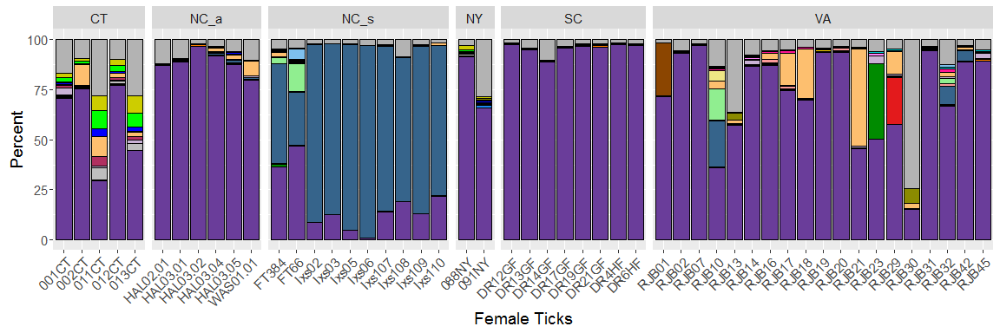

# Final Project Code and Data

* Due Tuesday 2016/5/24 (last day of exam period) at 9am.
* You must fork this repository as described in the [HW Submission 
Exercise](https://github.com/Middlebury-Data-Science/HW-0#hw-submission-exercise).
* Ensure all data files and CSV files are in the folder `data`. So for example, 
say you want to load the the file `example.csv` in the `data` folder.  You need 
to run `read.csv("data/example.csv", header=TRUE)` and not 
`read.csv("example.csv", header=TRUE)`.
* Fill in the project details below.
* Delete everything in this file before the section "Project Details".
* Push/commit **all files** necessary for me to reproduce your final report.

#### Repository README Cover Page

Any good repository on GitHub will have an informative cover page. It is an
advertisement of your work and should give basic instructions on how to use
it/replicate your work. The contents of the file `README.md` end up being what's
on the repository cover page. For example:

* The [repo page for `dplyr`](https://github.com/hadley/dplyr).
* The contents of its [`README.md` file](https://github.com/hadley/dplyr/blob/master/README.md) (click on RAW).

The way you will create your `README.md` is via `README.Rmd`:

* **DO NOT EDIT** `README.md`
* Rather, edit `README.Rmd` and then Knit it. An updated `README.md` file will
be outputted.
* When you push/commit `README.md`, it will show up as your repo's cover page.

# Project Details

* Name: Paul Suberu

* Project title: Health in sub-Saharan Africa

* Abstract:I did my data science project on health in sub-Saharan Africa. Health has been one of the biggest issues in sub-Saharan Africa with a lot of diseases plaguing the continent, examples being the HIV/AIDS epidemic in the 1990's and 2000's, and the recent ebola epidemic in 2014. Health issues have affected African countries especially It can be argued that poverty is the main cause for a lot of the health issues in sub-Saharan Africa, because a lot of African governments lack the necessary resources to and infrastructure develop the health sectors, diseases that should and could be easily controlled spread. Also due to the geography, a lot of African countries get diseases that other areas don’t get. The way the problem has been solved is through a lot of international aid.

My thesis is "What has been the effect of increased or decreased expenditures on Health Sectors in Developing countries"? Using mortality rates and increase of immunization as variables of interest to study. I chose mortality rate because it is a snapshot of how many people are dying in a country and thought it would be a good measure. Next I chose immunization rates because I felt this would be an adequate marker of how the potential spread of diseases is being controlled as more immunization leads to less exposure to curable diseases in the future

