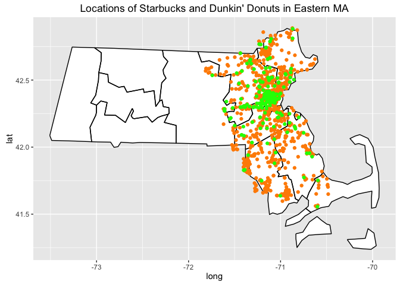

Delaney Moran  
# Project Synopsis

## Differential Distributions of Starbucks and Dunkin' Donuts in Eastern MA

#####Delaney Moran 

#####May 2016

### Abstract: 

  The present analysis explores the comparative distributions of Dunkin’ Donuts and Starbucks in eastern Massachusetts. It pulls income and demographic data from [Social Explorer](http://old.socialexplorer.com/pub/reportdata/HtmlResults.aspx?reportid=R11178485) and location data from the Google Places API radar searches. The MA shapefile was loaded [here](https://catalog.data.gov/dataset/tiger-line-shapefile-2015-state-massachusetts-current-census-tract-state-based-shapefile).

  Mapping both franchises in the six counties around Boston revealed that there are many more Dunkin’ Donuts than Starbucks locations in eastern Massachusetts. Additionally, the two franchises have different geographic distributions and appear to cater to different clientele, both spatially and economically. Starbucks are more densely distributed in cities and located in areas with higher median incomes. Dunkin' Donuts are more densely distributed in the suburbs, and located in areas with lower median incomes.


```
## OGR data source with driver: ESRI Shapefile 
## Source: "./data/tl_2015_25_tract/", layer: "tl_2015_25_tract"
## with 1478 features
## It has 12 fields
```

```
## Deleting rows:  5 6 8 13 199 200
```

```
## Deleting rows:  3 6 10 15 20 23 24 34 36 65 562 564 565 570 572 574 575 663 666 669 670 673 674 677 678 681 682 683 684 686 687 689 693 694 695 697 698 699 701 702 765 766 768 769 770 781 782 783 785
```



__Figure 1.__ Orange dots represent Dunkin Donuts locations and green dots represent Starbucks locations in the greater Boston area.


__Figure 2.__ A linear regression revealed that median income does significantly predict Starbucks densities, such that census tracts with higher median incomes have more Starbucks. This effect was subtle (a very small slope), but nonetheless significant (p = 0.0017). For Dunkin' Donuts, the relationship was only marginally significant (p = 0.0660), and equally subtle, but, interestingly, of opposite magnitude! In census tracts with higher median incomes, there were fewer Dunkin' Donuts.
