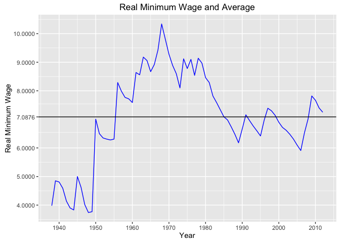

# Final Project Code and Data

* Due Tuesday 2016/5/24 (last day of exam period) at 9am.
* You must fork this repository as described in the [HW Submission 
Exercise](https://github.com/Middlebury-Data-Science/HW-0#hw-submission-exercise).
* Ensure all data files and CSV files are in the folder `data`. So for example, 
say you want to load the the file `example.csv` in the `data` folder.  You need 
to run `read.csv("data/example.csv", header=TRUE)` and not 
`read.csv("example.csv", header=TRUE)`.
* Fill in the project details below.
* Delete everything in this file before the section "Project Details".
* Push/commit **all files** necessary for me to reproduce your final report.


#### Repository README Cover Page

Any good repository on GitHub will have an informative cover page. It is an
advertisement of your work and should give basic instructions on how to use
it/replicate your work. The contents of the file `README.md` end up being what's
on the repository cover page. For example:

* The [repo page for `dplyr`](https://github.com/hadley/dplyr).
* The contents of its [`README.md` file](https://github.com/hadley/dplyr/blob/master/README.md) (click on RAW).

The way you will create your `README.md` is via `README.Rmd`:

* **DO NOT EDIT** `README.md`
* Rather, edit `README.Rmd` and then Knit it. An updated `README.md` file will
be outputted.
* When you push/commit `README.md`, it will show up as your repo's cover page.


# Project Details

* Name: Christian Lehner
* Project title: The Good Ol' Days - Mininum Wage, Policy, and CPI in the US
* Abstract: I am looking into the history of federal mininum wage, tbc..


```
## Warning: package 'ggplot2' was built under R version 3.2.4
```

```
## Warning: package 'plotly' was built under R version 3.2.4
```

>RPUB
[link](http://rpubs.com/clehner/FINAL)


>COULDN'T figure out how to do this with dpylr(lag leads etc) after a few hours! 
Essentially I am trying basically show using the nominal wage should be adjusted each year to CPI, and depending on which year we index the wage, the nominal wage drastically changes.


```
## Warning: Removed 12 rows containing missing values (geom_path).
```

```
## Warning: Removed 30 rows containing missing values (geom_path).
```




>The geom_step is representative of the federal mininum wage, the longer the step the longer congress hadn't adjusted 
wages. Real Mininum wage is shown in purple in 2012 dollars, the CPI is based from 1982-1984 = 100.
>This is supposed to be plotly output as seen on rpubs.. but I can seem to get it to work after trying for a while.
>Also thinking about logarithmic scale.


```r
# wage_cpi <- wage_cpi %>% 
#   mutate(keeping_up = ifelse(CPI==CPI[1], 1, ifelse(CPI==CPI[1], lag(keeping_up)*(1+(lag(CPI)/100)), NA)))
# 
# 
# wage_cpi <- wage_cpi %>% 
#   mutate(keeping_up = ifelse(CPI==CPI[1], 1, NA),
#          keeping_up = ifelse(CPI!=CPI[1], lag(keeping_up)*(1+(lag(CPI)/100)), NA))
# 
# 
# 
# wage_cpi <- wage_cpi %>% 
#   mutate(keeping_up = ifelse(CPI==CPI[1], 1, lag(keeping_up*(1+(lead(CPI)/100)))))


# con <- read.csv("data/congress-terms.csv", header = TRUE) %>% tbl_df
# #https://github.com/fivethirtyeight/data/tree/master/congress-age
# con <- subset(con, party %in% c('R','D') & chamber == "senate")
# View(con)
# con$termstart <-as.Date(con$termstart)


# con_prop <- con %>% 
#   group_by(congress,party) %>% 
#   tally() %>% 
#   group_by(congress) %>%
#   mutate(prop=)


# ggplot(wage, aes(Year, Minimum.Wage)) + ylim(5,9) +
#   geom_step(data=wage,aes(Year,Minimum.Wage,group=1)) +
#   geom_vline(xintercept=as.numeric(wage$Year[6]), linetype=4)+
#   theme(axis.text.x  = element_text(angle=90, vjust=.5))#line at 2006
#six state vote to raiseArizona, Colorado, Missouri, Montana, Nevada, and Ohio, in 2006


# ggplot(wage, aes(Year, Minimum.Wage)) + ylim(5,9) +
#   geom_area(aes(fill=Minimum.Wage)) + 
#   geom_line(data=wage,aes(Year,Minimum.Wage,group=1)) +
#   geom_smooth() + 
#   geom_vline(xintercept=as.numeric(wage$Year[6]), linetype=4)
# ggplot(wage,aes(x = Year,y = Minimum.Wage)) +
#   geom_area() +
#   geom_area( position = 'stack', fill="darkgreen")
# 
# con_prop <- con %>% 
#   group_by(congress,party) %>% 
#   tally() %>% 
#   group_by(congress) %>%
#   mutate(prop=)
# 
# class(con_prop$congress)
# con_prop$congress<- as.numeric(levels(con_prop$congress))[con_prop$congress]
# prop.table(table(con_prop), 3)
# con_prop$congress <- factor(con_prop$congress, levels = con_prop$congress[order(con_prop$congress)])
# ggplot(con_prop, aes(congress,n, fill = party))+
#   geom_bar(stat="identity") + theme(axis.text.x  = element_text(angle=90, vjust=.5))
# con1<- con %>% 
#   group_by(congress,party, termstart) %>% 
#   tally()
# 
# 
# states$state<- states$state_abbrev
# 
# con<- left_join(con, states, by = "state")
# ggplot(con1, aes(termstart, n, fill = party))+
#   geom_bar(stat="identity") + theme(axis.text.x  = element_text(angle=90, vjust=.5))
```

>This is code I am working on.


