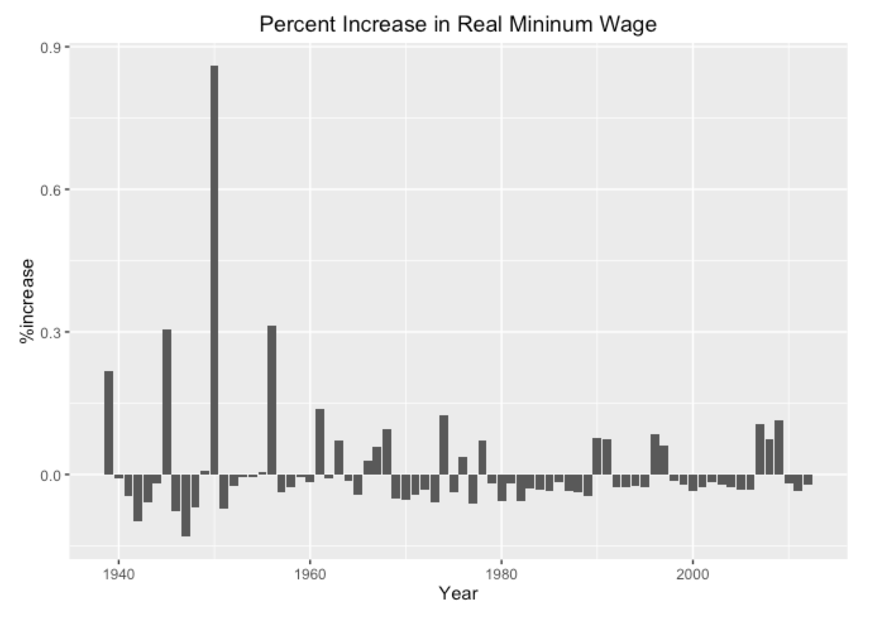

#**A Brief Look into Minimum Wage in the United States: An Analysis Utilizing Data, History, and Economics** 

###**Christian M. Lehner, (BA)^1^ and Albert Y. Kim, PhD^2^**
^1^Expected BA in Economics, Middlebury College, Middlebury, VT   
^2^Assistant Professor of Statistics, Middlebury College, Middlebury, VT.
(Instructed, and Reviewed) 

##**Abstract**
Objectives --- This research is centered on the history of minimum wage, its relevance today, and future implications in the United States.  
Methods --- Data was collected mainly from the Bureau of Labor Statistics, Quandl, Google Trends, and the Department of Labor. This paper will inform you of the background behind raising the minimum wage, and how soon the federal minimum wage should be raised to 15 dollars an hour, and why it should be indexed.  There is no shortage of research behind purchasing power, the cost of living, and accessibility to consumer goods as the topic is difficult to compare quantitatively. There are many indices that are used to compare the changes in prices, and the cost of living, so it is important to be consistent both in a time series and cross-sectionally. I used the language of R (3.2.3) on the Rstudio platform (0.99.879), and made accessible the code and through GitHub, and RPubs.    
Conclusions --- Minimum wage policy revolves in a stew of both moral motivations and economic effects. This paper attempts to inform you of the important aspects of Minimum Wage with minimal economic complexity, and give basis to your potentially new opinion.

##**Introduction and Background**  
The minimum wage in the United States is set both by the federal government and by states. The federal government sets a national hourly wage floor that all employers have to abide with some exemptions.  States can pass new state minimum hourly wage floors but those floors have to be greater than the federally instituted minimum wage.  Despite the set floors for wages, there are many loop holes to evade paying full wages.  Therefore, as of the 2013 current population survey, there are about 3 million people working at or below the minimum wage.  Thus, as of 2013, an estimated 4.3 percent of hourly earners were being paid the minimum wage or less. In 2014, this percentage decreased to 3.9 percent. Hourly earners make up 58 percent of the 77.2 million people who comprise the US labor force, so there were roughly 3 million people working at or below the minimum wage in 2014 [BLS](http://www.bls.gov/opub/reports/minimum-wage/archive/characteristics-of-minimum-wage-workers-2014.pdf). Of these 3 million workers, roughly 1.7 million were being paid less than 7.25 dollars an hour due to loopholes in the law and working illegally.  Although the data are limited and more extrapolative past the 1950’s, this project investigates minimum wage from its conception in 1938 up to the present.   

As with many major reforms, it took a while for the United States to regulate employers. The Fair Labor Standards Act of 1938 was the first major reform protecting hourly workers and the first to institute a minimum wage and maximum of shift lengths and hours worked in a week. Although the FLSA affected only about one fifth of the labor force and set a 25-cent minimum wage, or about $4 in 2012 dollars, and a 44-hour workweek, it set a precedent for labor regulation.

The FLSA was not passed without contention. The state of New York had instituted a minimum wage before the federal government, and in 1936, Joseph Tipaldo was sent to jail for paying his workers less then the minimum wage.  His lawyers used habeas corpus as the state minimum wage was found to be unconstitutional which rendered the state law void by the Supreme Court decision of Morehead vs. New York. [DOL](https://www.dol.gov/oasam/programs/history/flsa1938.htm)   

The Supreme Court’s decision had the opposite effect however, in the long run. The decision was so unpopular that many rallied behind FDR and his labor reform allowing him to pass the FLSA two years later with a clause about child labor. Even conservatives deemed the Court’s ruling a new “Dred Scott” decision condemning women and children to ‘economic’ slavery, as depicted by Congressmen Hamilton Fish, a conservative himself.  
FDR used his vast support, as shown by his landslide victory for his second term, partially from his repeal of the Prohibition and partly from successful reform, to threaten to pack the court with more justices if they didn’t allow reform. The Conservative Coalition founded at the end of his first term prevented the packing of the Court, but the FLSA was still passed leading to the inaccurate saying “a switch in time saved nine [the justices].” The decision in the case of the West Coast Hotel Company v. Parrish reversed the previous precedent and ruled the minimum wage constitutional. It was Chief Justice Robert’s decision to vote with the liberal minority of the court that allowed for the new precedent and set the country on a new path of labor regulations.  

Still applicable today, FDR was remembered for saying, "Do not let any calamity-howling executive with an income of $1,000 a day, ...tell you...that a wage of $11 a week is going to have a disastrous effect on all American industry." 

[RPubs](http://rpubs.com/clehner/FINAL)

This chart shows the change of the inflation adjusted minimum wage in percent. After 1940, there has only been only one period of deflation, occurring in 2009 after the Great Recession.  This is the only instance of the minimum wage increasing in real terms because of deflation. All other increases after 1940 are because of new regulation. As represented by the chart, in 1950 there was a wage increase over 90 percent. President Harry Truman roughly doubled the minimum wage from 40 cents to 75 cents. Although a 35 cents per hour increase seems minimal, it is still about 90 percent increase in real terms. There has only been one instance since then of an increase that substantial: California and New York’s new state minimum wage of 15 dollars per hour.  However, even those increases were not as large the 90 percent increase at the Federal level. Many have begun to propose a new federal minimum wage of 15 dollars but movement is slow. [HuffPost]( http://www.huffingtonpost.com/2013/08/28/minimum-wage-doubling_n_3819478.html)	
Since 1950, the increases in the federal minimum wage have been smaller and a spread over greater periods of time.

The code above represents how the wage was indexed for inflation after each new federal minimum wage increase. The red dots in the graph below show how much the value of the minimum wage depreciates shows the basic reasoning behind indexing the minimum wage each year. The black steps represent the nominal minimum wage, each increase indicating an amendment to the law to increase wages.

The composition of the labor force that works at or below the minimum wage is clearly not comprised of the same proportions of race, age, sex, and other categorizations that are present in the total workforce or even the hourly earners. “The fight for $15,” a movement petitioning to change the federal minimum wage to $15 is largely led by food service workers, especially those at fast food restaurants.  Some hourly earners also are compensated through tips from consumers, but this system has largely been critiqued, and many other countries do not have the same compensation structure for service industries. Food service and prep makes up roughly 25 percent of those at or below the minimum wage. This data is collected through the current population survey (CPS) of 2013 and represents a survey of around 60 thousand households. [CPS](http://www.bls.gov/cps/) 

##**Conclusions**
Obama has proposed increasing the minimum wage to 9 dollars and indexing it to inflation.[ObamaAdmin](https://www.whitehouse.gov/sites/default/files/uploads/sotu_minimum_wage.pdf) Indexing the minimum wage is pertinent and makes economic and moral sense. Inequality in pay is rampant in the United States across races, genders, and our CEO to worker pay ratio is the highest of any country. Estimates of the ratio are 350 to 1 with the average total compensation of a S&P CEO at $13.5 million. Although the percent of hourly earners making minimum wage has decreased those that do make minimum wage are worse of than in they were in 60 and 70's with their decreased access to consumer goods. States such as California and New York create good observational studies for the effects of a high minimum wage. The effects will be drawn out as both states institute their raised wage over multiple years. The morality behind raising the minimum wage to guarantee a better standard of living for hourly earners is counteracted by proposed negative economic effects, and the conservative approach of allowing wages to reflect productivity and value of work offered per hour. There are 29 states have instated minimum wages over the federal minimum wage, a sign the minimum wage is too low. Those 29 states also have varying costs of living, they are not specific expensive cities -- seatle is an example.

This data gives good background behind the history of minimum wage and its aspects across states. To further this project a logistic regression should be run using variables that increase a individuals probability of working at or below the minimum wage.  

##**Bibliography**
*I wanted to get all the data directly from the census sites such as DL or BLS but there databanks are so hard to navigate, its excruciating! Therefore some of the data I took from a 3rd parties that collected it legally from those government sites.*

###Bureau of Labor Statistics
Bureau of Labor Statistics, U.S. Department of Labor, The Economics Daily, Minimum wage workers account for 4.3 percent of hourly paid workers in 2013 on the Internet at http://www.bls.gov/opub/ted/2014/ted_20140403.htm (visited May 19, 2016).
URL: http://data.bls.gov/pdq/SurveyOutputServlet
Characteristics of Minimum Wage Workers
URL: http://www.bls.gov/opub/reports/minimum-wage/archive/characteristics-of-minimum-wage-workers-2014.pdf
Current Population Survey, 2013 Annual Averages
URL: http://www.bls.gov/cps/

###Department of Labor
History of FLSA
URL: https://www.dol.gov/oasam/programs/history/flsa1938.htm
URL: https://www.dol.gov/featured/minimum-wage/chart1
Myths of the Minimum Wage
URL: https://www.dol.gov/featured/minimum-wage/mythbuster   

###Others
Huffingtonpost "Doubling The Minimum Wage May Seem Insane, But It Happened In 1949"  
URL: http://www.huffingtonpost.com/2013/08/28/minimum-wage-doubling_n_3819478.html  
Data on State Minimum Wage  
URL: http://www.raisetheminimumwage.com/pages/minimum-wage-state  
URL: http://www.nytimes.com/2016/04/05/us/california-enacts-15-minimum-wage.html?_r=0  
Minimum Wage, July 2015  
URL: http://www.nytimes.com/2015/07/23/nyregion/new-york-minimum-wage-fast-food-workers.html  
Seattle Minimum Wage  
URL: http://murray.seattle.gov/minimumwage/#sthash.XadHaqd0.dpbs  
CNN Money, Decemeber Article  
URL: http://money.cnn.com/2013/12/29/news/economy/minimum-wage-states/  
The State of Texas Site
URL: http://www.twc.state.tx.us/jobseekers/texas-minimum-wage-law#currentMinimumWage  
The White House Website  
URL: https://www.whitehouse.gov/sites/default/files/uploads/sotu_minimum_wage.pdf  
*15 dollar minimum wage* and *minimum wage*  
Google Trends: Minimum Wage and its related terms  
Quandl -- ECPI_WAGE_AD  
URL: https://www.quandl.com/data/ECPI/WAGE_AD-Real-value-of-the-minimum-wage-1960-2011  
Total Working at or below Minimum Wage  
URL: http://www.governing.com/gov-data/economy-finance/minimum-wage-workers-by-state-statistics-2013-totals.html  
Internet Public Library -- Population of Each State  
URL: http://www.ipl.org/div/stateknow/popchart.html  
Raise The Minimum Wage   
URL: http://www.raisetheminimumwage.com/pages/minimum-wage-state  
